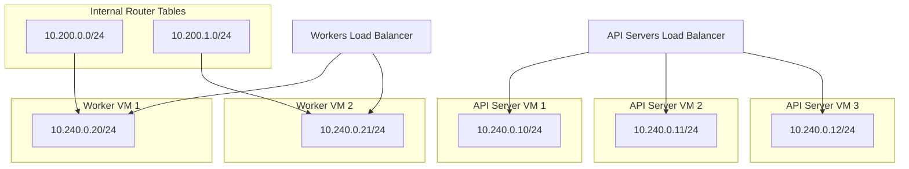

# Learning installing Kubernetes

## Prepare keys

Using Windows:

```bash
cd ~/projects/learning-kubernetes/labs/00-install-the-cluster;
sudo docker run --rm -v $(pwd)/ssh-keys:/ssh-keys alpine sh -c "apk add openssh-client;
    ssh-keygen -t rsa -N '' -b 4096 -f ./ssh-keys/id_rsa_local";
```

## Infrastructure



You can use different approaches for creating infrastructure:
- Azure
  - [Terraform](./azure/terraform/README-Linux.md)

## Certificate-authority

### Generate the certificates

Run in containers in Windows

```bash
cd ~/projects/learning-kubernetes/labs/00-install-the-cluster;
sudo docker run --rm -v $(pwd)/certs:/certs -w /certs --env EXTERNAL_IP=$EXTERNAL_IP alpine sh -c "chmod +x generate-kubernetes-certificates.sh; . generate-kubernetes-certificates.sh"
```

### Distribute the certificate among VMs

Run in containers in Windows

```bash
cd ~/projects/learning-kubernetes/labs/00-install-the-cluster;
sudo docker run --rm -v $(pwd):/workplace -w /workplace/certs alpine sh -c "apk add openssh-client; scp -i ../ssh-keys/id_rsa_local -o StrictHostKeyChecking=no ca.pem worker-0-key.pem worker-0.pem kuberoot@${PUBLIC_IP_ADDRESS_WORKER_0}:~/"
sudo docker run --rm -v $(pwd):/workplace -w /workplace/certs alpine sh -c "apk add openssh-client; scp -i ../ssh-keys/id_rsa_local -o StrictHostKeyChecking=no ca.pem worker-1-key.pem worker-1.pem kuberoot@${PUBLIC_IP_ADDRESS_WORKER_1}:~/"
sudo docker run --rm -v $(pwd):/workplace -w /workplace/certs alpine sh -c "apk add openssh-client; scp -i ../ssh-keys/id_rsa_local -o StrictHostKeyChecking=no ca.pem ca-key.pem kubernetes-key.pem kubernetes.pem service-account-key.pem service-account.pem kuberoot@${PUBLIC_IP_ADDRESS_CONTROLLER_0}:~/"
sudo docker run --rm -v $(pwd):/workplace -w /workplace/certs alpine sh -c "apk add openssh-client; scp -i ../ssh-keys/id_rsa_local -o StrictHostKeyChecking=no ca.pem ca-key.pem kubernetes-key.pem kubernetes.pem service-account-key.pem service-account.pem kuberoot@${PUBLIC_IP_ADDRESS_CONTROLLER_1}:~/"
sudo docker run --rm -v $(pwd):/workplace -w /workplace/certs alpine sh -c "apk add openssh-client; scp -i ../ssh-keys/id_rsa_local -o StrictHostKeyChecking=no ca.pem ca-key.pem kubernetes-key.pem kubernetes.pem service-account-key.pem service-account.pem kuberoot@${PUBLIC_IP_ADDRESS_CONTROLLER_2}:~/"
```

## Kubernetes Configuration Files

### Generate the Files

Run in a container in Windows

```bash
cd ~/projects/learning-kubernetes/labs/00-install-the-cluster;
sudo docker run --rm -v $(pwd):/workplace -w /workplace/kubernetes-configuration --env KUBERNETES_PUBLIC_ADDRESS=$KUBERNETES_PUBLIC_ADDRESS alpine sh -c "chmod +x generate-kubernetes-configuration.sh; sh generate-kubernetes-configuration.sh"
```

### Distribute the Configuration Files among VMs

Run in containers in Windows

```bash
cd ~/projects/learning-kubernetes/labs/00-install-the-cluster;
sudo docker run --rm -v $(pwd):/workplace -w /workplace/kubernetes-configuration alpine sh -c "apk add openssh-client; scp -i ../ssh-keys/id_rsa_local -o StrictHostKeyChecking=no worker-0.kubeconfig kube-proxy.kubeconfig kuberoot@${PUBLIC_IP_ADDRESS_WORKER_0}:~/";
sudo docker run --rm -v $(pwd):/workplace -w /workplace/kubernetes-configuration alpine sh -c "apk add openssh-client; scp -i ../ssh-keys/id_rsa_local -o StrictHostKeyChecking=no worker-1.kubeconfig kube-proxy.kubeconfig kuberoot@${PUBLIC_IP_ADDRESS_WORKER_1}:~/"
sudo docker run --rm -v $(pwd):/workplace -w /workplace/kubernetes-configuration alpine sh -c "apk add openssh-client; scp -i ../ssh-keys/id_rsa_local -o StrictHostKeyChecking=no admin.kubeconfig kube-controller-manager.kubeconfig kube-scheduler.kubeconfig kuberoot@${PUBLIC_IP_ADDRESS_CONTROLLER_0}:~/"
sudo docker run --rm -v $(pwd):/workplace -w /workplace/kubernetes-configuration alpine sh -c "apk add openssh-client; scp -i ../ssh-keys/id_rsa_local -o StrictHostKeyChecking=no admin.kubeconfig kube-controller-manager.kubeconfig kube-scheduler.kubeconfig kuberoot@${PUBLIC_IP_ADDRESS_CONTROLLER_1}:~/"
sudo docker run --rm -v $(pwd):/workplace -w /workplace/kubernetes-configuration alpine sh -c "apk add openssh-client; scp -i ../ssh-keys/id_rsa_local -o StrictHostKeyChecking=no admin.kubeconfig kube-controller-manager.kubeconfig kube-scheduler.kubeconfig kuberoot@${PUBLIC_IP_ADDRESS_CONTROLLER_2}:~/"
```

## Data Encryption Config and Key

### Generating the Data Encryption Config and Key

Run in a Container in Windows

```bash
cd ~/projects/learning-kubernetes/labs/00-install-the-cluster;
sudo docker run --rm -v $(pwd)/kubernetes-configuration:/workplace -w /workplace alpine sh -c "chmod +x generate-data-encryption-config.sh; sh generate-data-encryption-config.sh"
```

### Distribute the Data Encryption Config and Key among controller VMs

Run in Containers in Windows

```bash
cd ~/projects/learning-kubernetes/labs/00-install-the-cluster;
sudo docker run --rm -v $(pwd):/workplace -w /workplace/kubernetes-configuration alpine sh -c "apk add openssh-client; scp -i ../ssh-keys/id_rsa_local -o StrictHostKeyChecking=no encryption-config.yaml kuberoot@${PUBLIC_IP_ADDRESS_CONTROLLER_0}:~/"
sudo docker run --rm -v $(pwd):/workplace -w /workplace/kubernetes-configuration alpine sh -c "apk add openssh-client; scp -i ../ssh-keys/id_rsa_local -o StrictHostKeyChecking=no encryption-config.yaml kuberoot@${PUBLIC_IP_ADDRESS_CONTROLLER_1}:~/"
sudo docker run --rm -v $(pwd):/workplace -w /workplace/kubernetes-configuration alpine sh -c "apk add openssh-client; scp -i ../ssh-keys/id_rsa_local -o StrictHostKeyChecking=no encryption-config.yaml kuberoot@${PUBLIC_IP_ADDRESS_CONTROLLER_2}:~/"
```

## Bootstrapping the etcd Cluster

Run in containers in Windows

```bash
cd ~/projects/learning-kubernetes/labs/00-install-the-cluster;
sudo docker run --rm -v $(pwd):/workplace -w /workplace/kubernetes-configuration alpine sh -c "apk add openssh-client; ssh -i ../ssh-keys/id_rsa_local -o StrictHostKeyChecking=no kuberoot@${PUBLIC_IP_ADDRESS_CONTROLLER_0} 'bash -s' < configure-etcd.sh"
```

```bash
cd ~/projects/learning-kubernetes/labs/00-install-the-cluster;
sudo docker run --rm -v $(pwd):/workplace -w /workplace/kubernetes-configuration alpine sh -c "apk add openssh-client; ssh -i ../ssh-keys/id_rsa_local -o StrictHostKeyChecking=no kuberoot@${PUBLIC_IP_ADDRESS_CONTROLLER_1} 'bash -s' < configure-etcd.sh"
```

```bash
cd ~/projects/learning-kubernetes/labs/00-install-the-cluster;
sudo docker run --rm -v $(pwd):/workplace -w /workplace/kubernetes-configuration alpine sh -c "apk add openssh-client; ssh -i ../ssh-keys/id_rsa_local -o StrictHostKeyChecking=no kuberoot@${PUBLIC_IP_ADDRESS_CONTROLLER_2} 'bash -s' < configure-etcd.sh"
```

```bash
cd ~/projects/learning-kubernetes/labs/00-install-the-cluster;
sudo docker run --rm -v $(pwd):/workplace -w /workplace/kubernetes-configuration alpine sh -c "apk add openssh-client; ssh -i ../ssh-keys/id_rsa_local -o StrictHostKeyChecking=no kuberoot@${PUBLIC_IP_ADDRESS_CONTROLLER_0} 'bash -s' < verify-etcd.sh"
```

Expected output:

```
fetch https://dl-cdn.alpinelinux.org/alpine/v3.14/main/x86_64/APKINDEX.tar.gz
fetch https://dl-cdn.alpinelinux.org/alpine/v3.14/community/x86_64/APKINDEX.tar.gz
(1/6) Installing openssh-keygen (8.6_p1-r2)
(2/6) Installing ncurses-terminfo-base (6.2_p20210612-r0)
(3/6) Installing ncurses-libs (6.2_p20210612-r0)
(4/6) Installing libedit (20210216.3.1-r0)
(5/6) Installing openssh-client-common (8.6_p1-r2)
(6/6) Installing openssh-client-default (8.6_p1-r2)
Executing busybox-1.33.1-r2.trigger
OK: 10 MiB in 20 packages
Warning: Permanently added '40.91.192.147' (ED25519) to the list of known hosts.
3a57933972cb5131, started, controller-2, https://10.240.0.12:2380, https://10.240.0.10:2379
f98dc20bce6225a0, started, controller-0, https://10.240.0.10:2380, https://10.240.0.10:2379
ffed16798470cab5, started, controller-1, https://10.240.0.11:2380, https://10.240.0.11:2379
```

## Bootstrapping the Kubernetes Control Plane

Run in containers in Windows

```bash
cd ~/projects/learning-kubernetes/labs/00-install-the-cluster;
sudo docker run --rm -v $(pwd):/workplace -w /workplace/kubernetes-configuration alpine sh -c "apk add openssh-client; ssh -i ../ssh-keys/id_rsa_local -o StrictHostKeyChecking=no kuberoot@${PUBLIC_IP_ADDRESS_CONTROLLER_0} 'bash -s' < configure-control-plane.sh"
sudo docker run --rm -v $(pwd):/workplace -w /workplace/kubernetes-configuration alpine sh -c "apk add openssh-client; ssh -i ../ssh-keys/id_rsa_local -o StrictHostKeyChecking=no kuberoot@${PUBLIC_IP_ADDRESS_CONTROLLER_0} 'kubectl get componentstatuses'"
```

```bash
cd ~/projects/learning-kubernetes/labs/00-install-the-cluster;
sudo docker run --rm -v $(pwd):/workplace -w /workplace/kubernetes-configuration alpine sh -c "apk add openssh-client; ssh -i ../ssh-keys/id_rsa_local -o StrictHostKeyChecking=no kuberoot@${PUBLIC_IP_ADDRESS_CONTROLLER_1} 'bash -s' < configure-control-plane.sh"
sudo docker run --rm -v $(pwd):/workplace -w /workplace/kubernetes-configuration alpine sh -c "apk add openssh-client; ssh -i ../ssh-keys/id_rsa_local -o StrictHostKeyChecking=no kuberoot@${PUBLIC_IP_ADDRESS_CONTROLLER_1} 'kubectl get componentstatuses'"
```

```bash
cd ~/projects/learning-kubernetes/labs/00-install-the-cluster;
sudo docker run --rm -v $(pwd):/workplace -w /workplace/kubernetes-configuration alpine sh -c "apk add openssh-client; ssh -i ../ssh-keys/id_rsa_local -o StrictHostKeyChecking=no kuberoot@${PUBLIC_IP_ADDRESS_CONTROLLER_2} 'bash -s' < configure-control-plane.sh"
sudo docker run --rm -v $(pwd):/workplace -w /workplace/kubernetes-configuration alpine sh -c "apk add openssh-client; ssh -i ../ssh-keys/id_rsa_local -o StrictHostKeyChecking=no kuberoot@${PUBLIC_IP_ADDRESS_CONTROLLER_2} 'kubectl get componentstatuses'"
```

## RBAC for Kubelet Authorization

Start a container in Windows

```bash
cd ~/projects/learning-kubernetes/labs/00-install-the-cluster;
sudo docker run --rm -v $(pwd):/workplace -w /workplace/kubernetes-configuration alpine sh -c "apk add openssh-client; ssh -i ../ssh-keys/id_rsa_local -o StrictHostKeyChecking=no kuberoot@${PUBLIC_IP_ADDRESS_CONTROLLER_0} 'bash -s' < configure-kubernetes-rbac.sh"
```

### Verify the Control Plate

Run in containers in Windows

```bash
cd ~/projects/learning-kubernetes/labs/00-install-the-cluster;
sudo docker run --rm -v $(pwd)/certs:/workplace -w /workplace --env KUBERNETES_PUBLIC_IP_ADDRESS=$KUBERNETES_PUBLIC_IP_ADDRESS alpine sh -c "apk add curl; curl --cacert ca.pem https://${KUBERNETES_PUBLIC_IP_ADDRESS}:6443/version"
```

Expected output:

```
https://${KUBERNETES_PUBLIC_IP_ADDRESS}:6443/version"
fetch https://dl-cdn.alpinelinux.org/alpine/v3.14/main/x86_64/APKINDEX.tar.gz
fetch https://dl-cdn.alpinelinux.org/alpine/v3.14/community/x86_64/APKINDEX.tar.gz
(1/5) Installing ca-certificates (20191127-r5)
(2/5) Installing brotli-libs (1.0.9-r5)
(3/5) Installing nghttp2-libs (1.43.0-r0)
(4/5) Installing libcurl (7.77.0-r1)
(5/5) Installing curl (7.77.0-r1)
Executing busybox-1.33.1-r2.trigger
Executing ca-certificates-20191127-r5.trigger
OK: 8 MiB in 19 packages
{
  "major": "1",
  "minor": "17",
  "gitVersion": "v1.17.3",
  "gitCommit": "06ad960bfd03b39c8310aaf92d1e7c12ce618213",
  "gitTreeState": "clean",
  "buildDate": "2020-02-11T18:07:13Z",
  "goVersion": "go1.13.6",
  "compiler": "gc",
  "platform": "linux/amd64"
}
```

## Bootstrapping the Kubernetes Worker Nodes

Start a container in Windows

```bash
cd ~/projects/learning-kubernetes/labs/00-install-the-cluster;
sudo docker run --rm -v $(pwd):/workplace -w /workplace/kubernetes-configuration alpine sh -c "apk add openssh-client; ssh -i ../ssh-keys/id_rsa_local -o StrictHostKeyChecking=no kuberoot@${PUBLIC_IP_ADDRESS_WORKER_0} 'bash -s' < configure-worker-0.sh"
```

```bash
cd ~/projects/learning-kubernetes/labs/00-install-the-cluster;
sudo docker run --rm -v $(pwd):/workplace -w /workplace/kubernetes-configuration alpine sh -c "apk add openssh-client; ssh -i ../ssh-keys/id_rsa_local -o StrictHostKeyChecking=no kuberoot@${PUBLIC_IP_ADDRESS_WORKER_1} 'bash -s' < configure-worker-1.sh"
```

### Verify the Worker Nodes

Run in containers in Windows

```bash
cd ~/projects/learning-kubernetes/labs/00-install-the-cluster;
sudo docker run --rm -v $(pwd):/workplace -w /workplace/kubernetes-configuration alpine sh -c "apk add openssh-client; ssh -i ../ssh-keys/id_rsa_local -o StrictHostKeyChecking=no kuberoot@${PUBLIC_IP_ADDRESS_CONTROLLER_0} 'kubectl get nodes'"
```

Expected output:

```
fetch https://dl-cdn.alpinelinux.org/alpine/v3.14/main/x86_64/APKINDEX.tar.gz
fetch https://dl-cdn.alpinelinux.org/alpine/v3.14/community/x86_64/APKINDEX.tar.gz
(1/6) Installing openssh-keygen (8.6_p1-r2)
(2/6) Installing ncurses-terminfo-base (6.2_p20210612-r0)
(3/6) Installing ncurses-libs (6.2_p20210612-r0)
(4/6) Installing libedit (20210216.3.1-r0)
(5/6) Installing openssh-client-common (8.6_p1-r2)
(6/6) Installing openssh-client-default (8.6_p1-r2)
Executing busybox-1.33.1-r2.trigger
OK: 10 MiB in 20 packages
Warning: Permanently added '20.103.252.69' (ED25519) to the list of known hosts.
NAME       STATUS   ROLES    AGE     VERSION
worker-0   Ready    <none>   2m27s   v1.17.3
worker-1   Ready    <none>   92s     v1.17.3
```

## Merged script

```bash
cd ~/projects/learning-kubernetes/labs/00-install-the-cluster;
sudo docker run --rm -v $(pwd)/certs:/certs -w /certs --env EXTERNAL_IP=$EXTERNAL_IP alpine sh -c "chmod +x generate-kubernetes-certificates.sh; . generate-kubernetes-certificates.sh"
sudo docker run --rm -v $(pwd):/workplace -w /workplace/certs alpine sh -c "apk add openssh-client; scp -i ../ssh-keys/id_rsa_local -o StrictHostKeyChecking=no ca.pem worker-0-key.pem worker-0.pem kuberoot@${PUBLIC_IP_ADDRESS_WORKER_0}:~/"
sudo docker run --rm -v $(pwd):/workplace -w /workplace/certs alpine sh -c "apk add openssh-client; scp -i ../ssh-keys/id_rsa_local -o StrictHostKeyChecking=no ca.pem worker-1-key.pem worker-1.pem kuberoot@${PUBLIC_IP_ADDRESS_WORKER_1}:~/"
sudo docker run --rm -v $(pwd):/workplace -w /workplace/certs alpine sh -c "apk add openssh-client; scp -i ../ssh-keys/id_rsa_local -o StrictHostKeyChecking=no ca.pem ca-key.pem kubernetes-key.pem kubernetes.pem service-account-key.pem service-account.pem kuberoot@${PUBLIC_IP_ADDRESS_CONTROLLER_0}:~/"
sudo docker run --rm -v $(pwd):/workplace -w /workplace/certs alpine sh -c "apk add openssh-client; scp -i ../ssh-keys/id_rsa_local -o StrictHostKeyChecking=no ca.pem ca-key.pem kubernetes-key.pem kubernetes.pem service-account-key.pem service-account.pem kuberoot@${PUBLIC_IP_ADDRESS_CONTROLLER_1}:~/"
sudo docker run --rm -v $(pwd):/workplace -w /workplace/certs alpine sh -c "apk add openssh-client; scp -i ../ssh-keys/id_rsa_local -o StrictHostKeyChecking=no ca.pem ca-key.pem kubernetes-key.pem kubernetes.pem service-account-key.pem service-account.pem kuberoot@${PUBLIC_IP_ADDRESS_CONTROLLER_2}:~/"
sudo docker run --rm -v $(pwd):/workplace -w /workplace/kubernetes-configuration --env KUBERNETES_PUBLIC_ADDRESS=$KUBERNETES_PUBLIC_ADDRESS alpine sh -c "chmod +x generate-kubernetes-configuration.sh; sh generate-kubernetes-configuration.sh"
sudo docker run --rm -v $(pwd):/workplace -w /workplace/kubernetes-configuration alpine sh -c "apk add openssh-client; scp -i ../ssh-keys/id_rsa_local -o StrictHostKeyChecking=no worker-0.kubeconfig kube-proxy.kubeconfig kuberoot@${PUBLIC_IP_ADDRESS_WORKER_0}:~/"
sudo docker run --rm -v $(pwd):/workplace -w /workplace/kubernetes-configuration alpine sh -c "apk add openssh-client; scp -i ../ssh-keys/id_rsa_local -o StrictHostKeyChecking=no worker-1.kubeconfig kube-proxy.kubeconfig kuberoot@${PUBLIC_IP_ADDRESS_WORKER_1}:~/"
sudo docker run --rm -v $(pwd):/workplace -w /workplace/kubernetes-configuration alpine sh -c "apk add openssh-client; scp -i ../ssh-keys/id_rsa_local -o StrictHostKeyChecking=no admin.kubeconfig kube-controller-manager.kubeconfig kube-scheduler.kubeconfig kuberoot@${PUBLIC_IP_ADDRESS_CONTROLLER_0}:~/"
sudo docker run --rm -v $(pwd):/workplace -w /workplace/kubernetes-configuration alpine sh -c "apk add openssh-client; scp -i ../ssh-keys/id_rsa_local -o StrictHostKeyChecking=no admin.kubeconfig kube-controller-manager.kubeconfig kube-scheduler.kubeconfig kuberoot@${PUBLIC_IP_ADDRESS_CONTROLLER_1}:~/"
sudo docker run --rm -v $(pwd):/workplace -w /workplace/kubernetes-configuration alpine sh -c "apk add openssh-client; scp -i ../ssh-keys/id_rsa_local -o StrictHostKeyChecking=no admin.kubeconfig kube-controller-manager.kubeconfig kube-scheduler.kubeconfig kuberoot@${PUBLIC_IP_ADDRESS_CONTROLLER_2}:~/"
sudo docker run --rm -v $(pwd)/kubernetes-configuration:/workplace -w /workplace alpine sh -c "chmod +x generate-data-encryption-config.sh; sh generate-data-encryption-config.sh"
sudo docker run --rm -v $(pwd):/workplace -w /workplace/kubernetes-configuration alpine sh -c "apk add openssh-client; scp -i ../ssh-keys/id_rsa_local -o StrictHostKeyChecking=no encryption-config.yaml kuberoot@${PUBLIC_IP_ADDRESS_CONTROLLER_0}:~/"
sudo docker run --rm -v $(pwd):/workplace -w /workplace/kubernetes-configuration alpine sh -c "apk add openssh-client; scp -i ../ssh-keys/id_rsa_local -o StrictHostKeyChecking=no encryption-config.yaml kuberoot@${PUBLIC_IP_ADDRESS_CONTROLLER_1}:~/"
sudo docker run --rm -v $(pwd):/workplace -w /workplace/kubernetes-configuration alpine sh -c "apk add openssh-client; scp -i ../ssh-keys/id_rsa_local -o StrictHostKeyChecking=no encryption-config.yaml kuberoot@${PUBLIC_IP_ADDRESS_CONTROLLER_2}:~/"
sudo docker run --rm -v $(pwd):/workplace -w /workplace/kubernetes-configuration alpine sh -c "apk add openssh-client; ssh -i ../ssh-keys/id_rsa_local -o StrictHostKeyChecking=no kuberoot@${PUBLIC_IP_ADDRESS_CONTROLLER_0} 'bash -s' < configure-etcd.sh"
sudo docker run --rm -v $(pwd):/workplace -w /workplace/kubernetes-configuration alpine sh -c "apk add openssh-client; ssh -i ../ssh-keys/id_rsa_local -o StrictHostKeyChecking=no kuberoot@${PUBLIC_IP_ADDRESS_CONTROLLER_1} 'bash -s' < configure-etcd.sh"
sudo docker run --rm -v $(pwd):/workplace -w /workplace/kubernetes-configuration alpine sh -c "apk add openssh-client; ssh -i ../ssh-keys/id_rsa_local -o StrictHostKeyChecking=no kuberoot@${PUBLIC_IP_ADDRESS_CONTROLLER_2} 'bash -s' < configure-etcd.sh"
sudo docker run --rm -v $(pwd):/workplace -w /workplace/kubernetes-configuration alpine sh -c "apk add openssh-client; ssh -i ../ssh-keys/id_rsa_local -o StrictHostKeyChecking=no kuberoot@${PUBLIC_IP_ADDRESS_CONTROLLER_0} 'bash -s' < configure-control-plane.sh"
sudo docker run --rm -v $(pwd):/workplace -w /workplace/kubernetes-configuration alpine sh -c "apk add openssh-client; ssh -i ../ssh-keys/id_rsa_local -o StrictHostKeyChecking=no kuberoot@${PUBLIC_IP_ADDRESS_CONTROLLER_1} 'bash -s' < configure-control-plane.sh"
sudo docker run --rm -v $(pwd):/workplace -w /workplace/kubernetes-configuration alpine sh -c "apk add openssh-client; ssh -i ../ssh-keys/id_rsa_local -o StrictHostKeyChecking=no kuberoot@${PUBLIC_IP_ADDRESS_CONTROLLER_2} 'bash -s' < configure-control-plane.sh"
sudo docker run --rm -v $(pwd):/workplace -w /workplace/kubernetes-configuration alpine sh -c "apk add openssh-client; ssh -i ../ssh-keys/id_rsa_local -o StrictHostKeyChecking=no kuberoot@${PUBLIC_IP_ADDRESS_CONTROLLER_0} 'bash -s' < configure-kubernetes-rbac.sh"
sudo docker run --rm -v $(pwd):/workplace -w /workplace/kubernetes-configuration alpine sh -c "apk add openssh-client; ssh -i ../ssh-keys/id_rsa_local -o StrictHostKeyChecking=no kuberoot@${PUBLIC_IP_ADDRESS_WORKER_0} 'bash -s' < configure-worker-0.sh"
sudo docker run --rm -v $(pwd):/workplace -w /workplace/kubernetes-configuration alpine sh -c "apk add openssh-client; ssh -i ../ssh-keys/id_rsa_local -o StrictHostKeyChecking=no kuberoot@${PUBLIC_IP_ADDRESS_WORKER_1} 'bash -s' < configure-worker-1.sh"
```

This may require 5-10 minutes.

## Connect to the Cluster via kubectl

```bash
sudo docker run -it --rm -v $(pwd):/workplace -w /workplace/kubernetes-configuration --env KUBERNETES_PUBLIC_ADDRESS=$KUBERNETES_PUBLIC_ADDRESS alpine sh -c "chmod +x configure-kubectl.sh; . configure-kubectl.sh; sh"
```

## Tests

```
kubectl create deployment nginx --image=nginx
kubectl create deployment httpd000 --image=httpd
kubectl get pods
kubectl create service nodeport nginx --tcp=80:80
kubectl create service nodeport httpd000 --tcp=80:80
kubectl get services
```

Expected output:

```
NAME         TYPE        CLUSTER-IP    EXTERNAL-IP   PORT(S)        AGE
httpd000     NodePort    10.32.0.127   <none>        80:31125/TCP   7s
kubernetes   ClusterIP   10.32.0.1     <none>        443/TCP        20h
nginx        NodePort    10.32.0.123   <none>        80:31657/TCP   7s
```

test URLs with browser or curl:

http://<worker-0-public-IP>:31125
http://<worker-0-public-IP>:31657
http://<worker-1-public-IP>:31125
http://<worker-1-public-IP>:31657
